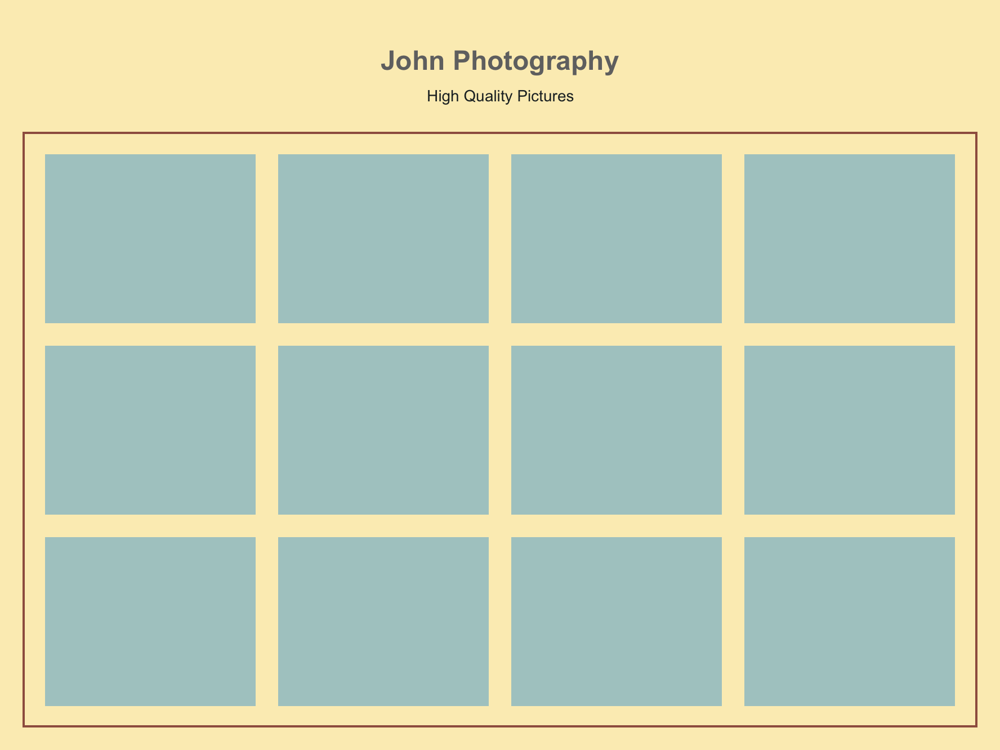

# Positioning `block` elements

Sometimes, we want to put `
` elements side-by-side. This can be done in several ways. In this assignment we will try to position a several `
`s one after another.

**Let's create an mockup for an image gallery.**

## Assignment

Create a mockup for an image gallery that look as follow.

**Rules:**

 - You are not allowed to touch the HTML file.
 - Use the `float` property to put the ‘photos’ side-by-side.

### Instructions

 1. Clone this repo.
 2. Create a “homework-03” branch from “homeworks”.
 3. Go to `assignment/03/work`.
 4. Start coding inside the file `style.css`.

When you finish with you work, upload it.
